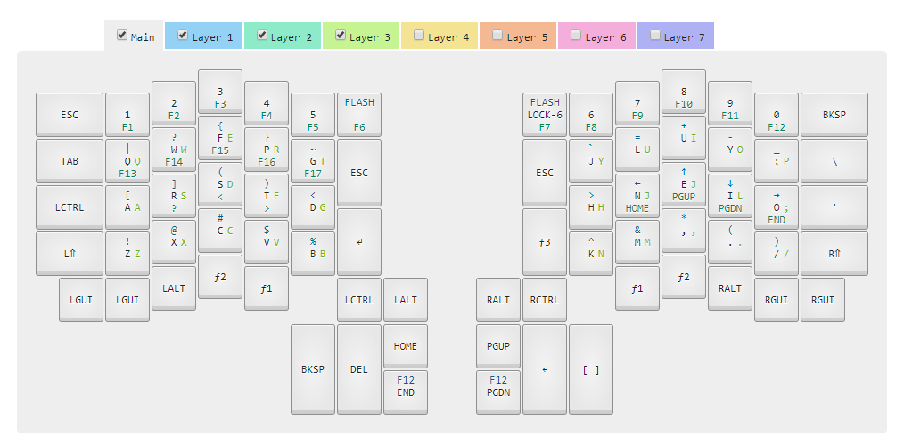

# Superdox

### Configuring System to compile Ergodox Infinity firmware

1. Set up drivers and configurator per https://kiibohd.github.io/wiki/#/Quickstart
1. Import the contents of the JSON file in this repo
1. Select the imported layout in the tool if not done so
1. Flash firmware one hand at a time per these these steps: https://kiibohd.github.io/wiki/#/Keyboards/InfinityErgodox
